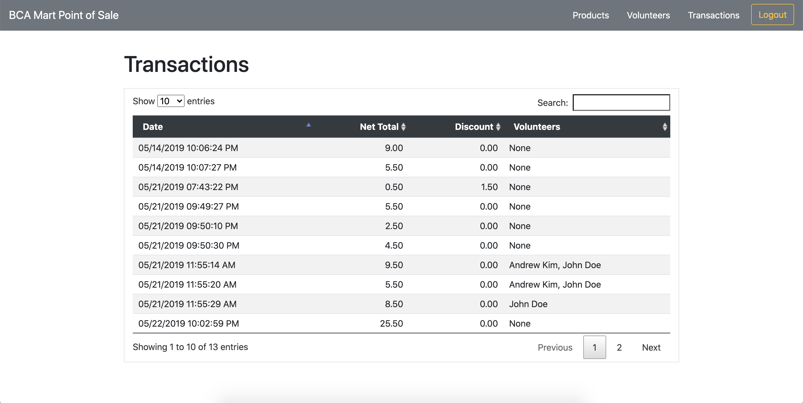

# Description
A basic **point-of-sale system** tailored for use by BCA Mart project team members and volunteer cashiers, inspired by Shopkeep. A high school senior capstone project.

*As of June 2019, this app is no longer being developed and maintained.*

## Core features
- Inventory management
- Volunteers management \*_incomplete_
- Transactions log
- Cashier POS screen w/ discount feature for volunteers
- Volunteer clock in/out system
- Authentication discerning between project vs. volunteer user

## Intended future features
#### Primary
- Department management
- Display sales data given date/time range
- Analytics & graphical data
- Dashboard
- Hosting
- Lots of frontend polish!
#### Secondary
- Dedicated inventory adjustment page
- Tabbed item button groups based on department (cashier screen)

## Images

## Development Stack
- Node.js using the Express.js framework
- Firebase Realtime DB and Auth
- jQuery + [DataTable](https://datatables.net) plugin
- PUG template engine
- Bootstrap

## Original Contributors
- [Kairui Huang](https://github.com/kairuihuang)
- [Jacob Salerno](https://github.com/jacobhaxor)
